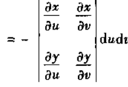

Remarks:

I wrote this paragraph in my sophomore year on another blog platform.
<http://www.cnblogs.com/HuisClos/articles/6966036.html> 

-----

在我们所讨论的三度空间（三维）中，能够出现的微分形式只有四种：

零次微分形式——函数 $f$

一次微分形式——线积分中出现的微分dx,dy,dz的一次式

`                                             `

二次微分形式——面积分中出现的微分dx,dy,dz的二次式  

`                                         `

三次微分形式——体积分中出现的微分dx,dy,dz的三次式

`                                                    `

注意：以上微分形式中至少有两个相同的dx,dy,dz项，每一个形式中只包含具有不同的dx,dy,dz的项。

我们还知道**联系**这些线、面、体积分的三个基本公式：

Green公式：

`                          `

`                        `其中D为L围成的闭区域，P、Q为D上的具有一阶连续偏微商的函数。 

Gauss公式：

`                               `

`                      `其中V为封闭曲面∑围成的闭区域，函数P、Q、R为V上有一阶连续偏微商的函数。

Stokes公式：

`                   `

`                        `其中封闭曲线L为曲面∑的边界，P、Q、R为V上有一阶连续偏微商的函数。

那么上述三个公式**之间**有什么**联系**？

这就是本文所要关注的。

我们也很容易联想到上述三个公式的更一般形式的**物理意义**，即**场论**中的三个**度**——梯度、旋度、散度

设 u 为数量场，v = Pi + Qj + Rk 为矢量场。

梯度：

` `旋度：

散度：

这些度都是怎样产生的？有何数学意义？

这也是本文所要关注的。

单变量微积分有Newton-Leibniz公式，即微分与积分是一对对立统一的运算

多变量微积分中微分、积分的对立统一是怎样体现的？

这又是本文所要关注的。

-----

怀着这三种疑惑，我们开始观察这些积分。

容易发现，

第二型线、面积分的积分区域都是有方向的。

然后容易想到可以把一重积分、二重积分看作第二型线、面积分的特例：积分区域也有方向。

三重积分同理也可定向。

所以，曲线长度因方向不同被定义成正负，亦如单变量微积分中的这个性质。

关于曲面，

定向是分为内外侧（看课本定义，即法线从起点连续移动直到回到起点，根据法线方向是否改变来为曲面定向）

（不可定向的曲面典型就是著名的莫比乌斯带。）

来张图吧

莫比乌斯带——不可定向

那么我们在这里只能讨论可定向的曲面咯。

所以，曲面面积在面积元素定向后因方向不同被被定义成正负。

根据二重积分定义，再将面积元素进行变元变换（看课本定义，不详细写）

当时是为了保持面积元素始终为正，而对式中Jacobi行列式取了绝对值。

但是现在，面积元素被允许有正负了，就没必要取绝对值了，就变成了这样

其中D已定向，D’是D经过变元逆变换得到的区域，自然是定向了的。

所以，

观察此式的性质 

（i）如果取y = x,则有

（ii）如果将y，x互换，则有

` `

此时，dydx≠dxdy,即dx,dy在乘积中次序**不能颠倒**，否则就是**正负**的差别。

满足上述两条的微分乘积被称为微分的外乘积，记为 

即 和      第二条和普通的微分乘积不同。

外微分形式：

由微分的外乘积乘函数组成的微分形式：

若P、Q、R、A、B、C、H为x,y,z的函数，

一次外微分形式：

二次外微分形式：

三次外微分形式：

接下来易证得三个外微分形式λ，µ，ν的外乘积满足分配律、结合律，但不满足交换律。（证明比较简单但编辑起来略繁就不贴了）：

如果λ，µ，ν是任意三个外微分形式

分配律：

交换律：

不满足结合律：

若µ为p次外微分形式，λ为q次外微分形式

这些定律用于后期推广证明。

容易联想到

外微分可**类比**为：**矢量外乘积**

-----

为了便于推广，我们可根据形式定义算子。

因此我们根据外微分形式ω定义外微分算子d,

零次外微分形式    函数 f 定义为

`                      `，其实这里就是普通的全微分算子

一次外微分形式    ，定义为

`                 `

`        `由于

`              `

`               `

`               `

`      `所以

由于

`   `

`  `      

` `所以

二次外微分形式 ，定义为

`     `

同理易得

`       `

三次外微分形式 ，定义为

`       `

同理，由于

`           `

所以

`                 `

`                         `

为什么等于零？因为每一项中至少有两个微分是相同的

所以，在三维空间中任意的三次外微分形式的外微分是**零**

外微分算子和普通微分算子运算方式相同，唯一的不同就是外微分算子运算后进行外乘积，而普通微分算子运算后进行正常的乘积。

于是我们得到了零次、一次、二次、三次外微分算子。

接下来，

设零次外微分形式ω=f,

就有

`     `

然后

`   `

由于

    

所以

假设f具有二阶连续偏微商，则有

`       `       

所以

`                    `

一次外微分形式  

`       `

于是

` `二次外微分形式

易得

三次外微分形式

易得  

这就是**Poincaré引理：**

**若ω为一个外微分形式，其微分形式的系数具有二阶连续偏微商，则。**

那么Poincaré引理的逆定理是否成立呢？成立。

先阐述**Poincaré引理之逆：**

**若ω是一个p次外微分式且，则存在一个p-1次外微分形式 a，使。**

其实我们学习场论中的有势场、管型场时已经证明过了。

这里具体不贴了。

-----

引入外微分后，接下来回到之前的疑惑之一——场论中的三个度究竟是什么含义，还有没更多的度？

先将三个度化成外微分形式，观察其意义。

零次外微分形式 ω = f, 零次外微分形式的外微分

`     `

又 f 的梯度为

`  `

所以**梯度**与**零次外微分形式的外微分**相对应。

一次外微分形式的外微分

又矢量 的旋度为

`     `

`                `

所以**旋度**与**一次外微分形式的外微分**相对应。

二次外微分形式的外微分

`     `

` `又矢量的散度

`     `

所以**散度**与**二次外微分形式的外微分**相对应。

三次外微分形式的外微分在三维空间中为零。

所以没有相对应的度。

三维空间里，也没有更多的度了。

综上，就是如下

外微分形式的次数       度

`       `0                    梯度

`       `1                    旋度

`       `2                    散度

那么，Poincaré引理与Poincaré引理之逆也有其场论意义了：

易得

Poincaré引理中

当ω为零次外微分形式ω = f,有

即 

当ω为一次外微分形式，记，有 

` `即 

Poincaré引理之逆中

等价于

即必有

等价于

即必有

-----
回到剩下两个疑惑——三个公式与高维空间中微分积分的关系

现将三个公式写成外微分形式。

Green公式

记，为一次外微分形式，于是

`        `

又线积分L可定向，所以该公式可写成

`                      `

同理，Gauss公式

`   `

又Σ定向，所以记

`                   `

该公式可写成

`                   `

同理Stokes公式

`              `

又线、面积分都为定向，将看作一次外微分形式

`          `

所以该公式可写成

`                      `

综上，可以看出，**Green公式、Gauss公式、Stokes公式实际上是一个公式**

`                                                                         `

其中ω为外微分形式，dω为ω的外微分，Σ为dω的封闭积分区域，∂Σ为Σ的边界，∫为区域有多少维数即多少重数。

含义：

**高次的外微分形式dω在区域上的积分等于低一次的外微分形式ω在区域的低一维空间边界上的积分。**

**外微分运算和积分是相互抵消的，亦如一维空间中Newton-Leibniz公式。**

由于三维空间中三次外微分形式的外微分为零，所以有了这个公式以后，区分区域和边界的公式就不再有了。

这个公式就是广义的Stokes公式

再写一遍

`                                       `

这个公式还可以推广到更一般的流形上（这个未来再说）

综上，在三维空间中，

外微分形式的次数      空间           公式

`      `0                    直线段         Newton-Leibniz公式

`      `1                    平面区域      Green公式

`      `1                    空间曲面      Stokes公式

`      `2                    空间中区域   Gauss公式

-----

完

